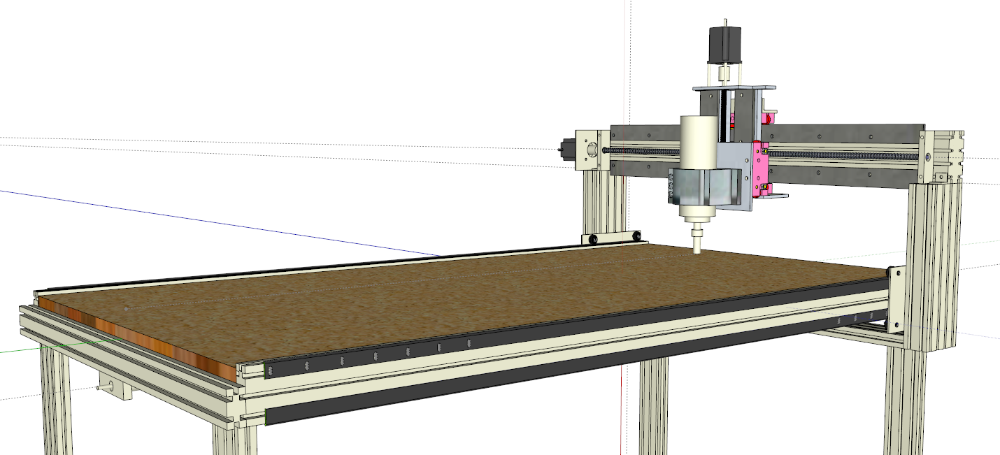
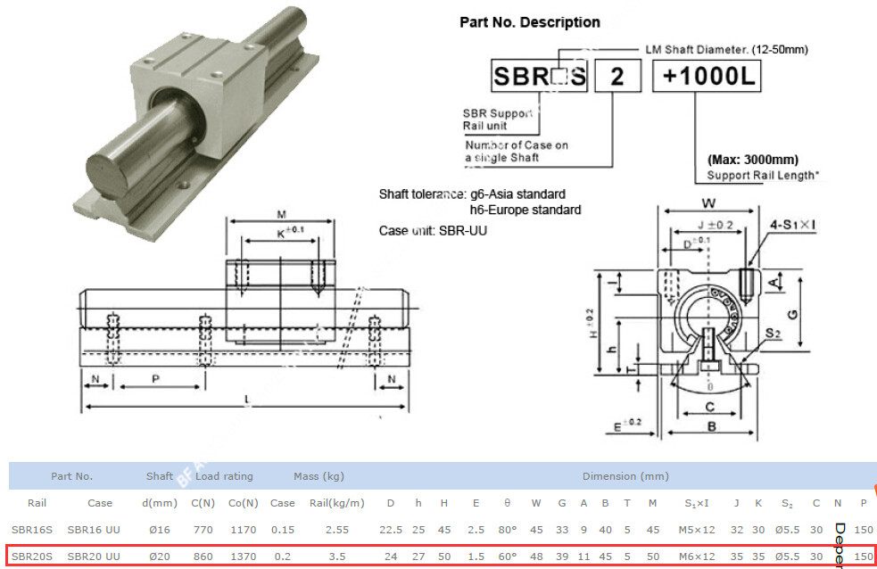

# General Design

# Rails

- 10m x 20 mm diameter stainless, (SF20UU trucks):  118 Euro 
- custom supports, made in aluminum: 30 Euro

Quantity : 20
Price Total : 60 Euro

# Lead Screws

Type : SFU1605

Quantity : 

2x 1.00 meter [Ebay](https://www.ebay.de/itm/EU-No-VAT-SFU1605-L800mm-Ballscrew-end-machined-Nut-BK-BF12-Support-Nut-housing/162964857789?hash=item25f17663bd:g:tOgAAOSwUoNaF9DN)

1x 60 cm 

Price : 150 - 200 Euro

# Motors

Type : Nema - 23

Quantity: 4 (2 for y axis, slaved)

Price: 300 Euro

[Ebay](https://www.ebay.es/itm/ACT-Motor-GmbH-4Axis-Nema23-CNC-Kit-23HS2442-Single-Shaft-4-2A-112mm-425oz-in/253051277058?hash=item3aeb080f02:g:rw4AAOSwIGlZbdCU)

Drivers & Power supplies & Mach3 interface card included

# Misc

- Home/Limit Switches : 30 Euro
- Shielded Cables: 40 Euro | Optional, otherwise 20 Euro for normal wires
- Ferrite Cores for extra shielding: 15 Euro
- Motor couplers : 20 Euros (8mm to 10 mm), custom made
- Control-Box, custom made, 15 Euro

# Spindle

Type: ERC-20 Collet

Price:  110 - 250 Euro, air cooled

Ebay: TODO

TODO: Discussable since any hand router could be retro fitted

# Chassy

Custom made, 5cm tubes, 40 Euro material (tubes, welding )

----------------------------------------------------------

*Total* Currently : 600 Euro 

